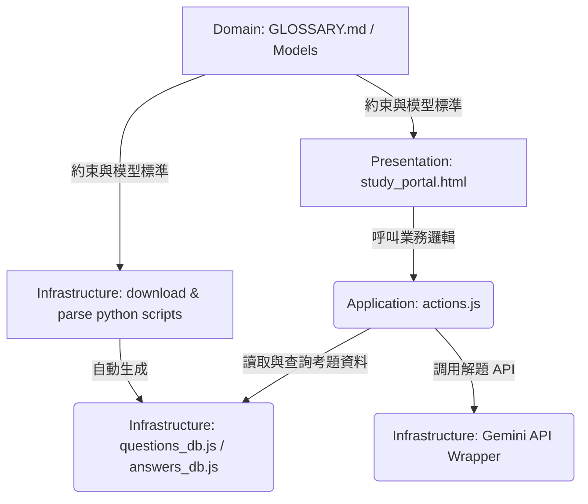

# 需求與開發計畫書 (Requirements & Plan Document - RPD)

本文件定義了「護理師歷屆甄選試題智能學習系統 (`nurse-exam`)」專案的需求分析、系統架構、資料解析策略及開發計畫。本專案旨在提供護理人員進行模擬測驗、錯題複習、考點標籤統計分析與 AI 輔助解題的 SPA 入口。

---

## 🔍 1. 專案定位與需求分析

### 1.1 專案定位
本專案移植自 `food-hygiene-exam` (食品衛生檢驗) 專案的成熟架構，旨在為護理考生建立一套完全運行於瀏覽器端的單網頁應用程式 (SPA)。考生無需安裝任何後端，即可進行離線測驗、智能錯題本整理、考點標籤統計分析及間隔重複複習。

### 1.2 題庫來源與資料獲取
題庫由以下兩部分組成，均為四選一的單選題：

#### 1. 考選部 (MOEX) 護理師高考歷屆真題
*   **年份範圍**：僅抓取近 5 年 (民國 110 年至 114 年)。
*   **專業科目**：固定為以下 5 個科目：
    1.  `基礎醫學` (包括解剖學、生理學、病理學、藥理學、微生物學與免疫學)
    2.  `基本護理學與護理行政` (包括護理原理、護理技術與護理行政)
    3.  `內外科護理學`
    4.  `產兒科護理學`
    5.  `精神科與社區衛生護理學`
*   **資料檔案**：每一科目包含「試題」、「答案」、「更正答案」三類 PDF 檔。比對時，**必須優先採用更正答案**，若無更正答案才採用原始答案，以確保標準答案的絕對準確性。
*   **來源網頁**：`https://wwwq.moex.gov.tw/exam/wFrmExamQandASearch.aspx`

#### 2. 臺南市政府衛生局護理人員歷屆甄選試題
*   **年份範圍**：全量抓取民國 92 年至 114 年的所有考題與答案。
*   **資料檔案**：包含試題 PDF 與答案 PDF。兩者多為獨立的 PDF 檔案 (例如：`F_1670480189170e.pdf` 為 92年9月21日試題，而 `F_1670480598970e.pdf` 為 92年9月21日答案)。
*   **來源網頁**：`https://health.tainan.gov.tw/page.asp?mainid=05E5FB73-340E-4D5D-9A7B-59C2DCD4F194&srcorcaid=49027783-987D-4D70-A08E-2FB99422F8E0`

### 1.3 核心功能需求
*   **答案對齊與多重驗證**：
    *   選擇題的答案比對是本系統的重中之重，必須透過解析程式自動將題目題號與標準答案進行嚴格對齊，並進行題數一致性檢查，若有不符必須拋出警告。
*   **考題來源區分與權重推薦**：
    *   資料庫中需明確標記 `category` (來源) 與 `weight` (權重)。
    *   台南市衛生局甄選試題權重較重 (預設 `1.5`)，考選部高考權重為 `1.0`。在錯題卡片推薦與模擬測驗組卷時，高權重題目將獲得優先呈現。
*   **考點標籤分類與統計分析**：
    *   系統需支援對所有考題進行「二級標籤分類」(例如：大類為 `基礎醫學`，細分標籤為 `解剖學`、`生理學`、`呼吸系統`、`血品` 等)。
    *   在爬取解析與導入資料庫時，會結合預定義關鍵字對照表與大語言模型 (LLM)，對每道題目進行自動標籤標記 (`tags` 欄位)。
    *   前端 SPA 需提供「考點統計分析儀表板」，顯示各標籤的題量分布，讓考生清楚了解哪些標籤 (知識點) 題量最多、出題機率最高。
    *   提供「標籤檢索與篩選模式」：考生可直接點選特定標籤，快速篩選出該標籤下的所有題目進行專題背誦。
*   **AI 智能解題助手**：
    *   在題目瀏覽與測驗介面中，針對考生不會的題目，提供「呼叫 AI 解題」功能。
    *   整合 Gemini API，將題目、選項與答案組成 Prompt 送出，生成結構清晰的 Markdown 解析，並於前端渲染。
    *   解析結果將快取至本機瀏覽器 LocalStorage，避免重複請求造成 API 額度消耗。

---

## 🛠️ 2. 技術與架構設計 (DDD 分層)

為確保開發之高內聚與可維護性，專案嚴格遵守 DDD 分層架構：

### 2.1 領域層 (Domain Layer)
*   **職責**：定義考題資料模型、標籤分類體系、答題歷史狀態等核心商業實體。
*   **核心文件**：[GLOSSARY.md](file:///c:/Users/etrny/.gemini/antigravity/scratch/nurse-exam/GLOSSARY.md) (定義數據庫欄位如 `id`、`subject`、`tags`、`weight` 等)。

### 2.2 應用層 (Application Layer)
*   **職責**：處理測驗計分、錯題本 LocalStorage 歸檔、間隔重複複習算法 (SuperMemo 簡化版)、以及標籤統計過濾與 AI 解題 Prompt 生成管線。
*   **核心檔案**：`actions.js` (封裝業務邏輯與 API 呼叫，供 Presentation 呼叫)。

### 2.3 基礎設施層 (Infrastructure Layer)
*   **職責**：PDF 自動化爬取下載、答案比對提取、自動標籤標記與資料庫檔案匯出。
*   **核心檔案**：
    *   `download_moex_exams.py` (考選部近 5 年 PDF 下載腳本)
    *   `download_tainan_exams.py` (臺南市甄試 PDF 下載腳本)
    *   `parse_exams.py` (PDF 解析、答案優先級比對、結合 LLM 自動貼標籤，並輸出靜態 JS 資料庫)
    *   `questions_db.js` / `answers_db.js` (結構化靜態題庫檔)

### 2.4 表現層 (Presentation Layer)
*   **職責**：提供極致美感的 UI 介面，支援測驗、錯題卡片、標籤統計分析與 AI 對話解題。
*   **核心檔案**：`study_portal.html` (前端 SPA)。
*   **設計美學**：
    *   主色調採用溫和醫護色系（以清新醫護綠 `#eef7f2`、防護藍 `#e0f2fe` 與極簡灰白為主）。
    *   使用 Bento Grid 結構與 CSS Grid 佈局展現標籤統計儀表板。
    *   優化行動端與平板之觸控按鈕，並提供即時的答題動畫反饋。

---

## 📈 3. 題庫爬取與提煉策略 (核心技術方案)

### 3.1 PDF 自動化下載
*   **台南市衛生局**：讀取 `content.md` 提取所有 `warehouse/.../*.pdf` 試題與答案連結，自動對應年份並下載。
*   **考選部**：編寫下載器，依據歷屆真題查詢網址，發起請求獲取近 5 年護理師高考 5 大學科的試題、答案、更正答案 PDF 並下載。

### 3.2 答案比對與雙軌解析
*   使用 `pdfplumber` 提取試題 PDF 與答案 PDF。
*   **答案解析優先級**：`更正答案.pdf` > `答案.pdf`。
*   比對演算法：
    1.  分別提取試題 PDF 中的題號列表，以及答案 PDF 中的題號-答案對應表。
    2.  執行嚴格的 Key-Value 對齊，確保題數 100% 一致。如果題數不符，將該考卷送入 LLM 進行語意容錯對齊，並輸出錯誤日誌。

### 3.3 自動標籤標記 (Auto-Tagging)
*   在解析考題時，將題目文字送入自動標籤模型（結合預定義關鍵字對照表與大語言模型）：
    - 基礎醫學題目 ➔ 依關鍵字自動標記 `["解剖學"]`、`["藥理學"]` 等。
    - 台南市衛生局題目 ➔ 依據內容標記相關臨床或護理技術標籤。
*   生成之 `tags` 將寫入 `questions_db.js`。

---

## 📋 4. 開發時程與計畫

*   **第一階段：需求與架構確認 (當前階段)**
    *   擬定本 RPD 計畫，並取得操作者確認。
    *   更新 [GLOSSARY.md](file:///c:/Users/etrny/.gemini/antigravity/scratch/nurse-exam/GLOSSARY.md) 與 [PENDING.md](file:///c:/Users/etrny/.gemini/antigravity/scratch/nurse-exam/PENDING.md)。
*   **第二階段：自動化題庫爬取與資料庫生成**
    *   實作 `download_moex_exams.py` 與 `download_tainan_exams.py`。
    *   實作 `parse_exams.py`（包含 PDF 解析、答案優先級比對、自動貼標籤功能）。
    *   輸出符合規格之 `questions_db.js` 與 `answers_db.js`。
*   **第三階段：前端模擬測驗門戶移植與優化**
    *   移植 `study_portal.html`，並修改 CSS 配色為醫護主題。
    *   實作「標籤統計儀表板」與「標籤篩選背誦模式」。
    *   整合 Gemini API 解題功能並實作 LocalStorage 快取。
    *   完成端對端測試，進行提交與推送。
